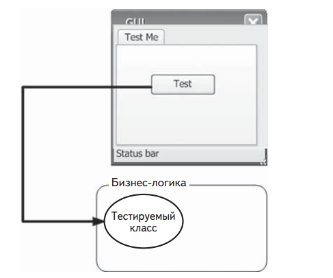
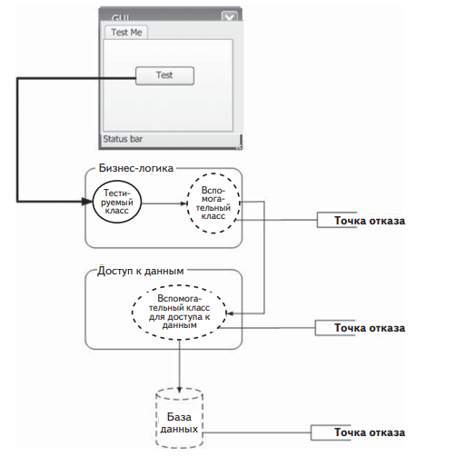
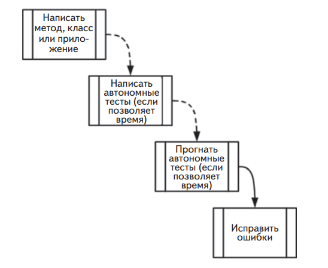
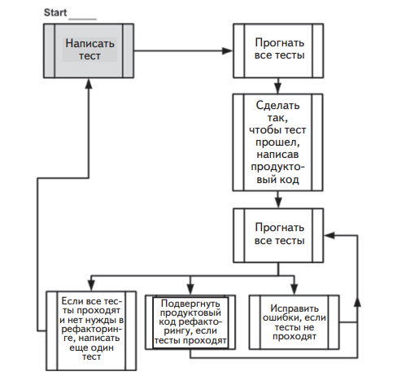

# ГЛАВА 1.Основы автономного тестирования

В этой главе:
 - Определение автономного теста.
 - Сравнение автономного и интеграционного тестирования.
 - Разбор простого примера автономного тестирования.
 - Что такое разработка через тестирование.


В любом деле есть первый шаг: вы впервые пишете программу, впервые проваливаете проект и впервые доводите до успешного завершения то, что собирались. Вы никогда не забудете свой первый раз, и
надеюсь, что свои первые тесты тоже не забудете. Возможно, вам уже
доводилось писать тесты и, быть может, вы даже помните, какие они
были плохие, неуклюжие, медленные или несопровождаемые (обычно люди такое помнят). Но не исключено, что все было наоборот: ваш
первый опыт написания автономных тестов был на удивление удачным, а эту книгу вы читаете, чтобы понять, что упустили из виду.
В этой главе мы сначала проанализируем «классическое» определение автономного теста и сравним его с понятием интеграционного
тестирования. Различие между ними многих приводит в замешательство. Затем мы рассмотрим плюсы и минусы автономного тестирования в сравнении с интеграционным и предложим более подходящее
определение «хорошего» автономного теста. В заключение мы поговорим о том, что такое разработка через тестирование, поскольку эта
методика часто ассоциируется с автономным тестированием. В этой
главе я также затрону ряд концепций, которые более подробно будут
рассмотрены далее.
Начнем с определения того, каким должен быть автономный тест.

## Определение автономного тестирования, шаг за шагом

Концепция автономного тестирования – не новость в индустрии
разработки программного обеспечения. Она зародилась еще на заре
создания языка программирования Smalltalk в 1970-х годах, и с тех
пор раз за разом оказывается, что это один из лучших способов
улучшения кода разработчиком, благодаря которому он еще и начинает глубже понимать функциональные требования к классу или
методу.
Кент Бек (Kent Beck) ввел концепцию автономного тестирования
в Smalltalk, а оттуда она перекочевала во многие другие языки программирования, превратившись в чрезвычайно полезную практику
разработки ПО. Прежде чем двигаться дальше, я хочу дать более
удачное определение автономного тестирования. Ниже приведено
классическое определение, взятое из википедии. Оно будет постепенно эволюционировать на протяжении этой главы и в разделе 1.4
примет окончательную форму.

    > **Определение 1.0**. Автономный тест – это часть кода (обычно метод), которая вызывает другую часть кода и затем проверяет правильность некоторых предположений. Если предположения не подтверждаются, считается, чтоавтономный тест завершился неудачно. Автономной единицей (unit) является метод или функция.

То, для проверки чего пишутся тесты, называется **тестируемой системой** (system under test – SUT).

    **Определение**. Акроним SUT означает «тестируемая система», некоторые
предпочитают использовать акроним CUT (class under test или code under
test – тестируемый класс или тестируемый код). Мы будем называть объект
тестирования SUT.

Раньше у меня было ощущение (именно ощущение – в этой книге
нет науки, только искусство), что это определение автономного теста
технически правильно, но за последние два года мое представление
о том, что такое автономная единица, изменилось. Для меня единица
означает «единица работы» внутри системы или «вариант использования» системы.

---
**Определение**
Единица работы — это совокупность действий от момента вызова какого-то
открытого метода в системе до единственного конечного результата, заметного тесту системы. Этот конечный результат можно наблюдать, не исследуя
внутреннее состояние системы, а только с помощью открытых API и поведения. Конечный результат может принимать следующие формы:
• вызванный открытый метод возвращает значение (т. е. является функцией, возвращающей не void);
• существует видимое изменение состояния или поведения системы до
и после вызова, которое можно обнаружить, не опрашивая внутреннее
состояние (примеры: в систему может войти ранее не существовавший
пользователь или, если система представляет собой конечный автомат,
то изменились ее свойства);
• имеет место обращение к сторонней системе, над которой у теста нет
контроля, и эта сторонняя система не возвращает никакого значения
либо возвращенное значение системой игнорируется (пример: обращение к сторонней системе протоколирования, которая была написана
не вами и исходный код которой вам недоступен).
---

Идея единицы работы для меня означает, что автономная единица может охватывать как один-единственный метод, так и несколько
классов и функций.
Возможно, вам кажется, что размер тестируемой автономной единицы следует сводить к минимуму. Мне тоже так казалось. Но больше не кажется. Я полагаю, что если удается создать более крупную
единицу работы, конечный результат которой более явственно виден
пользователю API, то и тесты окажутся более пригодными для сопровождения. Стараясь минимизировать размер единицы работы, вы
в конце концов дойдете до того, что будете тестировать не конечные
результаты, видимые пользователю открытого API, а промежуточные
остановки поезда на пути к конечному пункту назначения. Я еще вернусь к этой теме при обсуждении избыточного специфицирования
ниже.

**Уточненное определение 1.1**. Автономный тест – это часть кода, которая
вызывает единицу работы и затем проверяет ее конечный результат. Если
предположения о конечном результате не подтверждаются, считается, что
автономный тест завершился неудачно. Объектом автономного тестирования может быть как единственный метод, так и совокупность нескольких
классов.

Вне зависимости от используемого языка программирования один
из самых трудных аспектов заключается в том, чтобы определить, какой автономный тест считать «хорошим».

### О важности написания хороших автономных тестов

Понять, что такое единица работы, недостаточно.
Большая часть тех, кто пытается автономно тестировать свой код,
либо в какой-то момент сдаются, либо выполняют код, который автономным тестом не является. На самом деле, они либо рассчитывают на проведение комплексных и интеграционных тестов на гораздо
более поздней стадии жизненного цикла продукта, либо прибегают к
ручному тестированию кода с помощью специально написанных тестовых приложений или конечного разрабатываемого продукта, который используют для вызова своего кода.
Не имеет смысла писать плохой автономный тест, если только это
не первый шаг на пути постижения искусства написания хороших
тестов. Если вы собираетесь написать автономный тест плохо, не
осознавая этого, то лучше уж не писать его вовсе и избавить себя от
хлопот, связанных с пригодностью для сопровождения и соблюдением сроков. Определив, что такое хороший автономный тест, мы
можем быть уверены, что не отправимся в путь, не зная, куда направляемся.
Чтобы понять, что считать хорошим автономным тестом, нужно
приглядеться к тому, что именно делают разработчики, когда что-то
тестируют.
Как удостовериться в том, что сегодня код работает?

### Все мы писали автономные тесты (или что-то в этом роде)

Возможно, вы удивитесь, услышав, что уже не раз сами писали те или
иные автономные тесты. Вы хоть раз встречали разработчика, который не тестирует код до его сдачи? Я не встречал.
Возможно, вы пользовались консольным приложением, из которого вызывали различные методы класса или компонента, или специально написанным приложением с пользовательским интерфейсом
на базе WinForms или Web Forms, которое проверяло функциональность класса или компонента. А быть может, вы даже тестировали код
вручную, выполняя различные действия прямо из интерфейса реального приложения. Конечный результат всегда один – обретение субъективной уверенности в том, что код работает достаточно хорошо для
передачи его кому-то другому



**Рис. 1**. При классическом тестировании разработчик
использует графический интерфейс пользователя (ГИП)
для активации некоторого действия в тестируемом классе.
Затем проверяет результат.

На рис. 1 показано, как тестирует код большинство разработчиков. Пользовательский интерфейс может отличаться, но принцип
обычно неизменен: использовать внешнюю программу для повторяющейся проверки чего-то или запустить само приложение и вручную
проверить его поведение.
Такие тесты, может быть, и полезны и, возможно, даже почти отвечают классическому определению автономного теста, но они очень
далеки от того, что я называю хорошим автономным тестом в этой
книге. И это подводит нас к первому и самому важному вопросу, с которым разработчик сталкивается при определении свойств хорошего
автономного теста: что является автономным тестом, а что – нет?

### Свойства хорошего автономного теста

Хороший автономный тест должен обладать следующими свойствами:

• он должен быть автоматизированным и повторяемым;
• его должно быть просто реализовать;
• он должен сохранять актуальность и завтра;
• любой должен иметь возможность выполнить его одним нажатием кнопки;
• он должен работать быстро;
• его результаты должны быть стабильны (тест всегда должен
возвращать один и тот же результат, если между двумя последовательными запусками ничего не менялось);
• он должен полностью контролировать тестируемую автономную единицу;
• он должен быть полностью изолирован (работать независимо
от других тестов);
• если тест завершается неудачно, то должно быть легко понять,
каков ожидаемый результат и в каком месте искать ошибку.

Многие путают процесс тестирования своей программы с концепцией автономного теста. Для начала задайте себе следующие вопросы о тестах, которые вы уже писали ранее.

Могу ли я выполнить и получить полезные результаты от автономного теста, который написал две недели, или месяц, или
несколько лет назад?
• Может ли любой член моей команды выполнить и получить
полезные результаты от автономных тестов, который я написал два месяца назад?
• Могу ли я прогнать все написанные мной автономные тесты
максимум за несколько минут?
• Могу ли я прогнать все написанные мной автономные тесты
одним нажатием кнопки?
• Могу ли я написать простой тест не более чем за несколько
минут?

Если вы ответили отрицательно хотя бы на один вопрос, то с высокой вероятностью написанное вами автономным тестом не является.
Это, безусловно, какой-то тест, и, возможно, он не менее важен, чем
автономный, но по сравнению с тестами, для которых ответы на все вышеупомянутые вопросы положительны, у него имеются недостатки.
«Так что же я до сих пор делал?» – спрашиваете вы. Вы занимались
интеграционным тестированием

## Интеграционные тесты

Я называю интеграционными любые тесты, которые не являются быстрыми и стабильными и пользуются одной или несколькими реально
существующими зависимостями между тестируемыми автономными
единицами. Так, тесты, в которых используется системное время или
реальная файловая система или реальная база данных, попадают в категорию интеграционных.
Например, если тест не контролирует системное время и в его коде
используется текущее время DateTime.Now, то при каждом запуске мы
на самом деле выполняем новый тест, потому что время изменяется.
Такой тест уже нельзя назвать стабильным.
Само по себе это не плохо. Я считаю интеграционные тесты важным дополнением к автономным, просто их надо четко разделять,
чтобы складывалось ощущение «безопасной зеленой зоны», о которой я буду говорить ниже.
Если в тесте используется реальная база данных, то он уже работает не только в памяти, а это значит, что его действия труднее аннулировать, чем при использовании одних лишь подставных данных в
памяти. Кроме того, тест будет работать дольше, поскольку не способен контролировать реальность. Автономные тесты должны быть
быстрыми, интеграционные обычно гораздо медленнее. Когда на руках сотни тестов, роль играют даже доли секунды.
Интеграционные тесты рискуют столкнуться и еще с одной проблемой: тестирование слишком многих аспектов за раз.
Что происходит, когда ваш автомобиль ломается? Как узнать, в чем
проблема, не говоря уже о том, чтобы починить? Двигатель состоит
из многих подсистем, каждая из них зависит от других, а все вместе
они порождают конечный результат: машина едет. Если машина перестает ехать, ошибка может быть в любой подсистеме – и даже не в
одной. Только интеграция всех подсистем (или уровней) дает машине
возможность двигаться. Можно считать, что движение автомобиля –
последний и решающий интеграционный тест всех составляющих ее
частей. Если этот тест не проходит, вина лежит на всех частях; если
проходит – то проходят тест и все части.
То же самое относится и к программному обеспечению. Большинство разработчиков тестирует функциональность своего кода с помощью окончательного пользовательского интерфейса. Нажатие кнопки запускает последовательность событий – классы и компоненты
работают совместно, чтобы породить конечный результат. Если этот
тест не проходит, то все программные компоненты, как одна команда, проваливаются, и тогда может быть трудно понять, что привело к
ошибке операции в целом (рис. 1.2).
В книге Bill Hetzel «The Complete Guide to Software Testing» (Wiley,
1993) интеграционное тестирование определено как «упорядоченная
1994) последовательность испытаний, в ходе которых программные и (или)
аппаратные элементы объединяются и тестируются, до тех пор пока
не будет собрана вся система». Это определение не вполне соответствует тому, что многие делают постоянно, считая это частью разработки и автономного тестирования, а не интеграционного тестирования
системы.



**Рис. 2**. В интеграционном тесте может быть много точек отказа.
Все автономные единицы должны работать совместно,
и каждый может отказать, поэтому найти источник ошибки не всегда просто.

Приведем более подходящее определение интеграционного тестирования.

**Определение**. Интеграционное тестирование – это тестирование единицы
работы при отсутствии полного контроля над ней и с использованием одной или нескольких реальных зависимостей, например, от времени, от сети, от
базы данных, от потоков, от генераторов случайных чисел и т. д.

Подведем итог: в интеграционном тесте используются реальные
зависимости, тогда как в автономных тестах единица работы изолируется от всех зависимостей, поэтому их результаты стабильны, и они
способны легко управлять всеми аспектами поведения автономной
единицы, моделируя нужное.
Вопросы, перечисленные в разделе 1, помогут вам оценить некоторые недостатки интеграционного тестирования. Попробуем
определить, каких качеств мы ожидаем от хорошего автономного
теста.

## Недостатки неавтоматизированных интеграционных тестов по сравнению с автоматизированными автономными тестами

Обратим вопросы, поставленные в разделе 1.2, к интеграционным
тестам и посмотрим, чего мы хотим достичь с помощью реальных автономных тестов.
• Могу ли я выполнить и получить полезные результаты от автономного теста, который написал две недели, или месяц, или
несколько лет назад?
 Если нет, то как узнать, работает ли еще функция, реализованная ранее? В течение времени жизни приложения его код постоянно изменяется и, если вы не можете (или не хотите) прогонять тесты всех ранее работавших функций после каждого
изменения, то можете ненароком что-то поломать. Я называю
это явление «случайным внесением ошибок», чаще всего такое случается, когда проект подходит к концу и разработчики
исправляют имеющиеся ошибки в условиях сильного стресса.
Иногда, исправляя старые ошибки, они вносят новые. Правда, было бы неплохо узнавать о поломке в течение трех минут
после того, как она произошла? Ниже вы узнаете, как этого добиться.

**Определение**. Регрессией называется одна или несколько единиц работы,
которые когда-то работали, а теперь перестали.

• Может ли любой член моей команды выполнить и получить полезные результаты от автономных тестов, который я написал два месяца назад?
 Этот вопрос очень похож на предыдущий, но находится на ступеньку выше. Мы хотим быть уверены, что, внося изменения
в свой код, не сломаем чей-то еще. Многие разработчики опасаются изменять код в унаследованных системах, поскольку
не знают, какой код зависит от изменяемого. По существу, они
рискуют перевести систему в неизвестное и, возможно, нестабильное состояние.
 Мало можно назвать вещей, столь же страшных, как неуверенность в том, работает еще приложение или уже нет, особенно
если его код писали не вы. Если бы точно знать, что мы ничего
не сломаем, то было бы совсем не так страшно приступать к
незнакомому коду, потому что страховочная сетка автономных
тестов всегда наготове.
 Хорошие тесты может выполнить любой.
Определение. Согласно википедии, унаследованным называется «исходный код, который рассчитан на более не поддерживаемую или снятую с производства операционную систему или иную компьютерную технологию», но
во многих компаниях так называют просто старую версию приложения, которая в настоящее время поддерживается на правах унаследованного кода.
Часто этот термин распространяют на код, с которым трудно работать, который трудно тестировать и даже просто читать.
Один мой клиент как-то определил унаследованный код приземленным образом: «код, который работает». Многим нравится такое
определение: «код, для которого нет тестов». В книге Michael Feathers
«Working Effectively with Legacy Code» (Prentice Hall, 2004) именно
это определение унаследованного кода принято в качестве официального, его мы и будем иметь в виду в этой книге.
• Могу ли я прогнать все написанные мной автономные тесты
максимум за несколько минут?
 Если вы не можете прогнать свои тесты быстро (секунды лучше минут), то будете прогонять их не так часто (раз в день, а то
и раз в неделю или даже месяц). Но дело в том, что мы хотим
узнать результат внесения изменений в код как можно быстрее, чтобы понять, не сломалось ли что-нибудь. Чем больше
времени проходит между прогонами тестов, тем больше изменений успевают внести в систему и тем больше (много боль-
ше) мест приходится просматривать в поисках ошибки, если
обнаруживается, что система перестала работать.
 Хорошие тесты должны выполняться быстро.
• Могу ли я прогнать все написанные мной автономные тесты
одним нажатием кнопки?
 Если не можете, то, вероятно, следует правильно сконфигурировать компьютер, на котором прогоняются тесты (например,
задать строки соединения с базой данных), либо же ваши автономные не полностью автоматизированы. Если вам не удалось
полностью автоматизировать тесты, то, скорее всего, вы будете
избегать их частого запуска – как и все остальные члены команды.
 Никто не любит тратить время на настройку машины для запуска тестов только ради того, чтобы убедиться, что система
все еще работает. Разработчики предпочитают заниматься более важными вещами, например, добавлять в систему новые
функции.
 Хорошие тесты должно быть легко выполнить в том виде, в
котором они написаны, – и не вручную.
• Могу ли я написать простой тест не более чем за несколько
минут?
 Опознать интеграционный тест проще всего по тому, сколько
времени уходит на его подготовку и реализацию, а не только
на выполнение. Чтобы понять, как его написать, нужно учесть
все внутренние, а иногда и внешние зависимости (базу данных
можно считать внешней зависимостью) – на все это требуется
время. Если вы не автоматизируете тесты, то наличие зависимостей мешает не так сильно, но ведь в этом случае вы утрачиваете все выгоды автоматизированного тестирования. Чем
труднее написать тест, тем менее вероятно, что вы вообще будете писать новые тесты, а, если и будете, то только для проверки заботящих вас «существенных вещей». Но одна из сильных
сторон автономных тестов состоит в том, что они проверяют
все мелочи, которые могут сломаться, а не только «существенных вещи». Удивительно, сколько ошибок программист может
найти в коде, который считал простым и безошибочным.
 Если вы концентрируете внимание только на крупных тестах,
то покрытие логики программы тестами оказывается меньше. 
Многие части базовой логики кода остаются не протестированными (пусть даже покрыто больше компонентов), и многие
ошибки ускользают от рассмотрения.
 Хорошие тесты системы пишутся легко и быстро, коль скоро
вы поняли, какие принципы хотите применить к тестированию
своей конкретной объектной модели. Но хочу предупредить:
даже у разработчиков, собаку съевших на автономном тестировании, может уйти минут 30, а то и больше, чтобы понять,
как должен выглядеть самый первый тест объектной модели,
которую они раньше не тестировали. Это часть работы, от которой никуда не деться. Второй и последующие тесты той же
объектной модели даются куда проще.
Приняв во внимание все сказанное о том, что не является автономным тестом, и о том, какие черты желательны, чтобы тестирование
было полезным, я могу приступить к ответу на главный вопрос этой
главы: что такое хороший автономный тест?

## Из чего складывается хороший автономный тест?

Рассмотрев важные свойства, которыми должен обладать автономный тест, я готов дать окончательное определение.
Уточненное и окончательное определение 1.2. Автономный тест – это
автоматизированная часть кода, которая вызывает тестируемую единицу
работы и затем проверяет некоторые предположения о единственном конечном результате этой единицы. Автономный тест почти всегда пишется с
помощью того или иного каркаса автономного тестирования. Написать его
легко, а выполняется он быстро. Он заслуживает доверия, удобочитаем и
пригоден для сопровождения. Он стабилен, т. е. его результаты не меняются,
пока остается неизменным тестируемый код.
При первом знакомстве кажется, что это определение слишком высоко поднимает планку, особенно если учесть, сколько разработчиков
пишут автономные тесты плохо. Оно заставляет нас критически пересмотреть наш прежний подход к тестированию и сравнить его с тем,
как должно быть (заслуживающие доверия, удобочитаемые и пригодные для сопровождения тесты рассматриваются в главе 8).
В предыдущем издании этой книги я дал несколько иное определение автономного теста. Я говорил, что автономный тест «проверяет
только код, где имеется управляющая логика». Теперь я так не счи-
таю. В состав единицы работы обычно входит и последовательный
код тоже. Даже свойства, в коде которых нет никакой логики, используются в единице работы, пусть даже они не являются специальной
мишенью для тестов.
Определение. Кодом с управляющей логикой называется любой код, в котором имеются какие-то логические конструкции, даже совсем незначительные, а именно: предложения if, циклы, предложения switch или case,
вычисления и прочие элементы принятия решений.
Свойства (методы get и set в Java) – примеры кода, в котором обычно нет никакой логики, поэтому специально подвергать их тестированию необязательно. Скорее всего, этот код используется в тестируемой единице работы, но тестировать его напрямую нет смысла.
Однако помните: стоит только добавить в код свойства какую-нибудь
проверку, как надо будет эту логику протестировать.
В следующем разделе мы рассмотрим простой автономный тест,
написанный без применения какого-либо каркаса тестирования
(с каркасами тестирования мы начнем знакомиться в главе 2).

## **Пример простого автономного теста**

Автоматизированный автономный тест можно написать и без каркаса тестирования. На самом деле, с тех пор как у разработчиков стало
входить в привычку автоматизировать тестирование, я не раз видел,
как они это делают, не подозревая о существовании каркасов. В этом
разделе я покажу, как может выглядеть тест, созданный без использования каркаса, а в главе 2 мы сравним его с написанным для каркаса.
Допустим, у нас есть класс SimpleParser (приведен в листинге 1.1), и мы хотим его протестировать. В классе есть метод
ParseAndSum , который принимает строку, состоящую из нуля или
более чисел, разделенных запятыми. Если чисел в строке нет, метод возвращает 0. Если есть только одно число, оно возвращается в
виде int. Если чисел несколько, они складываются и возвращается
сумма (хотя в настоящий момент код умеет обрабатывать только
случаи нуля или одного числа). Да, я знаю, что ветвь else лишняя,
но из того, что ReSharper призывает вас спрыгнуть с моста, вовсе не
следует, что так и надо делать. На мой взгляд, else делает код более
удобочитаемым.

**Листинг 1**. Простой класс разбора, подлежащий тестированию

```Csharp
public class SimpleParser
{
 public int ParseAndSum(string numbers)
 {
 if(numbers.Length==0)
 {
 return 0;
 }
 if(!numbers.Contains(“,”))
 {
 return int.Parse(numbers);
 }
 else
 {
 throw new InvalidOperationException(
 "Пока умею обрабатывать только 0 или 1 число!");
 }
 }
}
```

Можно создать проект простого консольного приложения,
которое ссылается на сборку с этим классом, и написать класс
SimpleParserTests, показанный в листинге ниже. Тестовый метод
вызывает метод продуктового класса (тестируемый) и проверяет возвращенное им значение. Если оно не совпадает с ожидаемым, тестовый метод выводит сообщение на консоль. Он также перехватывает
все исключения и тоже печатает их на консоли.

**Листинг 2**. Простой написанный вручную метод для тестирования
класса SimpleParser

```Csharp
class SimpleParserTests
{
 public static void TestReturnsZeroWhenEmptyString()
 {
 try
 {
 SimpleParser p = new SimpleParser();
 int result = p.ParseAndSum(string.Empty);
 if(result!=0)
 {
 Console.WriteLine(
 @"***SimpleParserTests.TestReturnsZeroWhenEmptyString:
 -------
 ParseAndSum должен вернуть 0 для пустой строки");
 }
 }
 catch (Exception e)
 {
 Console.WriteLine(e);
 }
 }
}
```

Затем написанные тесты можно вызвать из выполняемого консольным приложением метода Main, который показан в следующем листинге. Метод Main в данном случае играет роль простого
исполнителя тестов, который вызывает тесты один за другим, давая
им возможность выводить что-то на консоль. Поскольку приложение выполняемое, оно может работать без вмешательства человека
(при условии, что тесты не открывают интерактивных диалоговых
окон).

**Листинг 3**. Прогон написанных вручную тестов с помощью простого
консольного приложения

```Csharp
public static void Main(string[] args)
{
 try
 {
 SimpleParserTests.TestReturnsZeroWhenEmptyString();
 }
 catch (Exception e)
 {
 Console.WriteLine(e);
 }
}
```

Обязанность перехватывать исключения и выводить соответствующие сообщения на консоль (чтобы исключения не мешали выполнять последующие методы) возлагается на сами тестовые методы.
По мере увеличения количества тестов мы можем добавлять в Main
вызовы все новых и новых методов. Каждый тест отвечает за вывод
описания проблемы (если таковая имеется) на экран.
Понятно, что приведенный выше тест написан на скорую руку. Если
бы у нас было несколько подобных тестов, то, наверное, мы завели бы
общий метод ShowProblem , которым могли бы пользоваться все тесты
для единообразного форматирования сообщений об ошибках. Можно
было бы также добавить вспомогательные методы для проверки
объекта на null, обнаружения пустых строк и т. д. – чтобы не писать
одни и те же длинные строки в нескольких тестах.

В листинге ниже показано, как мог бы выглядеть этот тест при наличии чуть более общего метода ShowProblem.

**Листинг 4**. Использование общего метода ShowProblem

```Csharp
public class TestUtil
{
 public static void ShowProblem(string test,string message )
 {
    string msg = string.Format(@"
    ---{0}---
    {1}
    --------------------
    ", test, message);
    Console.WriteLine(msg);
 }
}
public static void TestReturnsZeroWhenEmptyString()
{
 // Используем API отражения в .NET для получения имени текущего метода
 // Можно было бы зашить его в код, но этот полезный прием следует знать 
 string testName = MethodBase.GetCurrentMethod().Name;
 try
 {
    SimpleParser p = new SimpleParser();
    int result = p.ParseAndSum(string.Empty);
    if(result!=0)
        {
        // Вызываем вспомогательный метод 
        TestUtil.ShowProblem(testName,
        "ParseAndSum должен вернуть 0 для пустой строки");
        }
 }
 catch (Exception e)
 {
    TestUtil.ShowProblem(testName, e.ToString());
 }
}
```

В каркасах автономного тестирования вспомогательные методы
носят более общий характер, поэтому и тесты писать проще. Об этом
мы будем говорить в главе 2. Но перед тем как отправиться туда, хотелось бы обсудить еще один важный вопрос: не как писать автономный тест, а когда на протяжении этапа разработки делать это. Вот тутто в игру и вступает методика разработки через тестирование.


## Разработка через тестирование

Итак, мы знаем, как писать структурированные, пригодные для сопровождения и заслуживающие доверия тесты с помощью каркаса автономного тестирования. Теперь возникает следующий вопрос: когда
это делать. Многие считают, что лучшее время для написания автономных тестов – по окончании разработки программы, однако растет
число тех, кто предпочитает писать тесты до создания продуктового
кода. Такой подход получил название «тесты сначала» или «разработка через тестирование» (test-driven development – TDD).
Примечание. Существуют разные точки зрения на точный смысл разработки через тестирование. Одни говорят, что все дело в написании тестов
сначала, другие – что в большом количестве тестов. Кто-то считает, что это
способ проектирования, а кто-то – что таким образом можно было бы определять поведение программы, уделяя собственно проектированию гораздо меньше внимания. Более полный обзор различных точек зрения на TDD
см. в статье «The various meanings of TDD» в моем блоге (http://osherove.
com/blog/2007/10/8/the-various-meanings-of-tdd.html). В этой книге под TDD
будет пониматься процесс разработки, при котором тесты пишутся сначала,
а проектирование играет вторичную роль (и обсуждаться не будет).
На рис. 1.3 и 1.4 показаны различия между традиционным кодированием и TDD



**Рис. 3**. Традиционный способ написания автономных тестов.
Пунктирными линиями представлены действия,
которые принято считать необязательными

TDD отличается от традиционной разработки, как показывает
рис. 1.4. Мы начинаем с теста, который не проходит. Затем переходим
к созданию продуктового кода, добиваясь, чтобы тест прошел, после
приступаем либо к рефакторингу кода, либо к созданию следующего
безуспешного теста.



**Рис. 4**. Разработка через тестирование – взгляд с высоты
птичьего полета. Обратите внимание на спиральный характер
процесса: написать тест, написать код, выполнить рефакторинг,
написать следующий тест. Это демонстрация инкрементной
природы TDD: мелкие шаги приводят к высококачественному
конечному результату

Эта книга посвящена технике написания хороших автономных тестов, а не разработке через тестирование, но я сам большой поклонник
TDD. Я написал несколько крупных приложений и каркасов с применением TDD, руководил командами, использующими TDD в работе, и провел более сотни курсов и семинаров по TDD и методикам
автономного тестирования. На собственном опыте я убедился, что
TDD помогает создавать высококачественный код и высококачественные тесты, причем структура кода оказывается лучше, чем раньше. Я убежден, что вы сможете применить эту методику с выгодой, но

за это придется заплатить (временем на изучение, внедрение и т. п.).
Впрочем, затраты окупятся сторицей.
Важно понимать, что TDD ничего не гарантирует: и проект может
провалиться, и тесты могут получиться нестабильными или непригодными для сопровождения. Очень легко поддаться обаянию самой
методики TDD и перестать обращать внимание на способ написания
автономных тестов: выбор имен, акцент на удобочитаемость и пригодность для сопровождения. Легко даже упустить из виду, то ли они
тестируют, что нужно, и не содержат ли ошибок. Вот потому-то я и
пишу эту книгу.
Методика TDD очень проста.
1. Написать тест, который не проходит, и тем самым доказать,
что в конечном продукте отсутствует некий код или функциональность. Тест пишется так, будто продуктовый код уже работает, поэтому отказ теста означает, что в продуктовом коде есть
ошибка. Если бы я хотел добавить в класс калькулятора функцию запоминания последней суммы LastSum, то написал бы
тест, проверяющий, что LastSum действительно содержит правильное значение. Этот тест не откомпилировался бы, поэтому
я добавил бы ровно столько кода, чтобы компиляция прошла
успешно (не реализуя запоминание числа), и снова прогнал бы
код. На этот раз он выполнился бы, но с ошибкой, потому что
функциональность еще не реализована.
2. Сделать так, чтобы тест прошел, написав продуктовый код,
отвечающий ожиданиям теста. Продуктовый код должен быть
максимально простым.
3. Подвергнуть его рефакторингу, т. е. переработать его. Добившись успешного завершения теста, мы вправе либо перейти к
следующему тесту, либо переработать код: сделать его более
удобочитаемым, устранить дублирование и т. д.
Заниматься рефакторингом можно после написания нескольких
тестов или после каждого теста. Это важный шаг, он повышает удобочитаемость и сопровождаемость кода, гарантируя, что все ранее написанные тесты проходят.
Определение. Под рефакторингом понимается изменение части кода без
изменения его функциональности. Переименование метода – это рефакторинг. Разбиение длинного метода на несколько более коротких – тоже рефакторинг. В обоих случаях программа делает то же, что и раньше, но ее становится проще сопровождать, читать, отлаживать и изменять.
Формулировка шагов TDD выглядит технической, но за ней стоит
обычная житейская мудрость. При правильном применении TDD качество кода устремится ввысь, количество ошибок уменьшится, ваша
уверенность в правильности программы повысится, время поиска
ошибок сократится, структура кода станет совершеннее, а начальник
будет доволен. Напротив, при неправильном применении TDD работа над проектом будет выбиваться из графика, время – тратиться
впустую, мотивация – ослабевать, а качество кода – снижаться. Это
палка о двух концах, и многие осознали это на собственной шкуре.
Технически, одно из важнейших достоинств TDD, о котором вам
никто не расскажет, состоит в том, что, наблюдая, как тест падает,
а затем проходит, хотя вы ничего в нем самом не изменяли, вы по
сути дела тестируете сам тест. Если вы ожидаете, что тест не должен
пройти, а он проходит, то, вероятно, есть ошибка в самом тесте или
вы тестируете не то, что нужно. Если ранее падавший тест должен
пройти, но все равно не проходит, значит, либо в тесте ошибка, либо
вы не того ожидаете.
В этой книге речь пойдет об удобочитаемых, пригодных для сопровождения и заслуживающих доверия тестах, но наибольшую уверенность в своих тестах вы получаете, когда видите, как они падают и
проходят в должное время. TDD в этом очень помогает, и это одна из
причин, по которой разработчики, практикующие TDD, гораздо меньше занимаются отладкой, чем те, кто автономно тестирует свой код
постфактум. Если доверяешь тесту, то нет нужды отлаживать просто
«на всякий случай». А доверие возникает, когда видишь обе стороны
теста: ту, что падает, и ту, что проходит, – то и другое в свое время.

## Три основных навыка успешного практика TDD

 Для успешной разработки через тестирование нужно обладать тремя
основными навыками: знать, как писать хорошие тесты, писать их
раньше кода и правильно структурировать тесты.
• Из того, что вы пишете тесты сначала, еще не следует, что
они будут удобочитаемыми, пригодными для сопровождения
или заслуживающими доверия. Навыки написания хороших
автономных тестов – как раз то, о чем написана эта книга.
• Из того, что вы пишете удобочитаемые и пригодные для сопровождения тесты, еще не следует, что вы получите те же выгоды, что при написании их сначала. Умение писать тесты
сначала – это то, чему учат книги по TDD (по крайней мере,
большая их часть), хотя о навыках написания хороших тестов
в них нет ни слова. Особенно я рекомендовал бы книгу Kent
Beck «Test-Driven Development: by Example»1
 (Addison-Wesley
Professional, 2002).
• Из того, что вы пишете тесты сначала, и они являются
удобочитаемыми и пригодными для сопровождения, еще не
следует, что в итоге получится хорошо структурированная
система. Только навыки проектирования позволяют сделать
код красивым и пригодным для сопровождения. По этой
теме я рекомендую книги Steve Freeman, Nat Pryce «Growing
Object-Oriented Software, Guided by Tests» (Addison-Wesley
Professional, 2009) и Robert C. Martin «Clean Code»2
 (Prentice
Hall, 2008).
Прагматический подход к изучению TDD состоит в освоении всех
трех аспектов по отдельности и по очереди. Я рекомендую такой подход, потому что часто видел, как люди пытались освоить все три навыка одновременно, тратили на это огромные усилия и в конце концов сдавались, потому что гора оказалась слишком крутой.
Приняв постепенный подход к изучению этой области знаний, вы
избавите себя от постоянного страха сделать что-то не так в той части,
которая в данный момент находится на периферии внимания.
Что же касается конкретного порядка изучения, то у меня нет какой-то определенной схемы. Буду рад, если вы расскажете о своем
опыте и дадите свои рекомендации по приобретению этих навыков.
О том, как со мной связаться, написано на сайте http://osherove.com.

## Резюме

В этой главе я дал определение хорошего автономного теста как теста,
обладающего следующими свойствами.
• Это автоматизированный код, который вызывает какой-то
метод и затем проверяет предположения о логике поведения
этого метода или класса.
• Он написан с применением каркаса автономного тестирования.
• Его легко написать.
• Он быстро работает.
• Его может многократно выполнять любой член команды разработчиков.
Чтобы понять, что такое автономная единица, нужно разобраться,
какого рода тестированием вы занимались до сих пор. Мы назвали
этот тип тестирования интеграционным, потому что тестируется набор автономных единиц, зависящих друг от друга.
Важно понимать разницу между автономными и интеграционными тестами. Этим знанием вы будете пользоваться в повседневной
работе, решая, куда поместить тест, какие тесты когда писать и какой
вариант лучше подходит в конкретной ситуации. Оно поможет также
исправить уже имеющиеся проблемы с тестами, которые стали сильно докучать.
Мы также остановились на минусах интеграционного тестирования без поддерживающего каркаса: такие тесты трудно писать и автоматизировать, они работают медленно и требует предварительного
конфигурирования. И хотя мы не отказывается от интеграционных
тестов в проекте, автономные тесты гораздо полезнее на ранних этапах, когда ошибки не так серьезны, их проще искать и объем подлежащего просмотру кода меньше.
Наконец, мы рассмотрели методику разработки через тестирование, рассказали, чем она отличается от традиционного кодирования
и каковы ее основные преимущества. TDD позволяет достичь очень
высокого (близкого к ста процентам для логического кода) покрытия
кода тестами (какая часть кода выполнена в результате прогона тестов). TDD также вселяет уверенность в то, что тестам можно доверять. TDD «тестирует тесты» в том смысле, что позволяет наблюдать,
как они сначала не проходят, а потом проходят. У TDD есть и много
других достоинства, например: содействие в проектировании, снижение сложности и помощь в решении сложных проблем шаг за шагом.
Но невозможно в полной мере овладеть TDD, не научившись писать
хорошие тесты.
В следующей главе мы напишем первые автономные тесты с применением NUnit – каркаса тестирования, ставшего стандартом де
факто для разработчиков на платформе .NET.