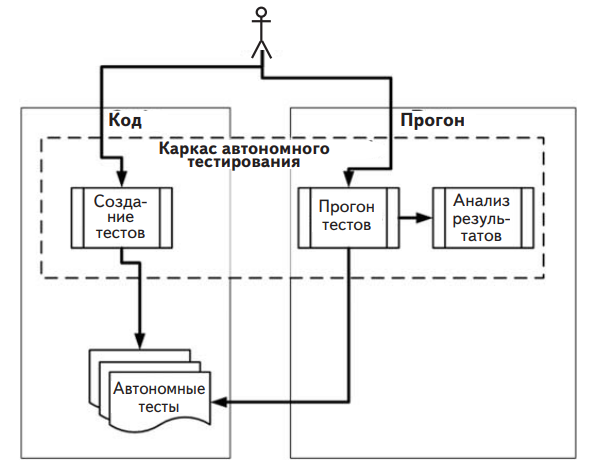

# Каркасы автономного тестирования
Ручные тесты – отстой. Вы пишете свой код, запускаете его в отладчике, нажимаете клавиши, заставляющие приложение делать то, что
вам надо, а затем повторяете все это снова всякий раз, как добавился
новый код. И нужно все время помнить, как новый код может повлиять на старый. Ручной работы все больше. Факт

Выполнение тестов и регрессионного тестирования полностью
вручную, повторяя одни и те же действия, как мартышка, – процесс,
отнимающий много времени и чреватый ошибками. Из всего связанного с разработкой ПО это самая ненавистная программистам
деятельность. Проблему можно смягчить с помощью инструментальных средств. Каркасы автономного тестирования помогают писать
тесты быстрее, используя документированный API, выполнять их автоматически и легко получать наглядное представление результатов.
И каркасы ничего не забывают! Посмотрим внимательнее, что они
нам предлагают.

##  Что предлагают каркасы автономного тестирования

Многие читатели этой книги при написании тестов сталкивались со
следующими ограничениями.
- Тесты не были структурированы. Приходилось изобретать
колесо всякий раз, как нужно было протестировать какую-то функцию. Один тест оформлялся в виде консольного приложения, для другого нужна была форма с графическим интерфейсом, для третьего – веб-форма. На тестирование не хватало
времени, тесты не удовлетворяли требованию «простоты реализации».

- Тесты не были повторяемыми. Ни вы, ни члены команды не
могли прогнать тесты, написанные в прошлом. Тем самым нарушалось требование «повторяемости» и затруднялся поиск
регрессионных ошибок. Каркас позволяет просто и автоматически писать повторяемые тесты.

- Тесты не покрывают все важные части кода. Тестируются не все
существенные участки кода, т. е. участки, содержащие какуюто логику, хотя каждый из них потенциально может содержать
ошибку. (Методы чтения и установки свойств не содержат
логики, но входят в состав какой-то единицы работы.) Если
бы писать тесты было проще, то у вас было бы больше желания
этим заниматься и обеспечивать лучшее покрытие.

**Рис. 1**. При написании автономных тестов используются
библиотеки, входящие в состав каркаса тестирования.
Затем тесты прогоняются с помощью специального инструмента
или непосредственно в IDE, а результаты (представленные в виде
текста или в графическом интерфейсе каркаса) анализируются
разработчиком или автоматизированной процедурой сборки

Короче говоря, вам не хватает каркаса для создания, прогона и анализа результатов тестов. На рис. 2.1 показаны те этапы разработки
программного обеспечения, к которым имеет отношение каркас автономного тестирования.
Каркасы включают библиотеки и модули, помогающие разработчикам проводить автономное тестирование своего кода (см. табл. 2.1).
Но у них есть и другая сторона – прогон тестов в составе автоматизированной сборки; об этом я расскажу в последующих главах.

**Таблица 1**. Как каркас автономного тестирования помогает
разработчику создавать, прогонять и анализировать результаты тестов

|Аспект автономного тестирования|Чем помогает каркас|
|:----------------------------- |:------------------|
|Простота и упорядоченность написания тестов|Каркас предоставляет разработчику библиотеку классов, которая содержит: базовые классы и интерфейсы, которым можно унаследовать; атрибуты, помечающие, какие методы являются тестовыми; классы утверждений, в которых имеются специальные методы для верификации кода.|
|Выполнение одного или всех тестов|Каркас включает в себя исполнитель тестов (консольный или графический инструмент), который: находит в коде тесты;автоматически выполняет их;отображает состояние во время выполнения;допускает автоматизацию путем запуска из командной строки.|
|Анализ результатов прогона тестов|Исполнитель тестов обычно предоставляет следующую информацию:сколько тестов было выполнено;сколько тестов не было выполнено;сколько тестов не прошло;какие тесты не прошли;почему тесты не прошли; сообщение, указанное вами при вызове метода ASSERT; место в коде, где была обнаружена ошибка;возможно,полную трассировку стека в случае исключения, приведшего к ошибке; при этом имеется возможность перейти в точку вызова различных методов, перечисленных к стеке.|

На момент написания этой книги существовало более 150 каркасов автономного тестирования – практически для любого сколько-нибудь распространенного языка программирования. Достойный
список можно найти по адресу http://en.wikipedia.org/wiki/List_of_
unit_testing_frameworks. Кстати, для одной лишь платформы .NET
имеется по меньшей мере три активно поддерживаемых каркаса
автономного тестирования: MSTest (от Microsoft), xUnit.net и NUnit.
При этом NUnit когда-то был стандартом де факто. Сейчас идет борьба
между MSTest и NUnit – просто потому, что MSTest уже встроен в
Visual Studio. Но если у меня есть выбор, я предпочитаю NUnit ради
некоторых возможностей, о которых пойдет речь ниже в этой главе, а
также в приложении, посвященном инструментам и каркасам.

**Примечание**. Само по себе использование каркаса автономного тестирования еще не гарантирует, что написанные вами тесты будут удобочитаемыми, пригодными для сопровождения и заслуживающими доверия или что
они будут покрывать всю логику, которую вы хотели бы протестировать. Как
добиться, чтобы автономные тесты обладали этими свойствами, мы будем
обсуждать в главе 7 и в других местах книги.

##  Каркасы семейства xUnit

Термин каркасы xUnit закрепился за этими каркасами автономного
тестирования, потому что их названия обычно начинаются с первой
буквы языка программирования, для которого каркас предназначен.
Для C++ это CppUnit, для Java – JUnit, для .NET – NUnit, а для
Haskell – HUnit. Не все, но большинство каркасов следуют этому
соглашению об именовании.

Мы в этой книге будем использовать каркас NUnit для .NET, который упрощает написание, прогон и анализ результатов тестов. NUnit
появился на свет в результате прямого переноса широко известного
каркаса JUnit для Java, но с тех пор сделал гигантский шаг вперед в
части структуры и удобства использования, далеко отошел от своего
прародителя и вдохнул новую жизнь в целую экосистему каркасов
тестирования, которая все больше и больше изменяется. Обсуждаемые ниже концепции будут понятны также программистам на Java
и C++.

### Знакомство с проектом LogAn

Для изучения тестирования мы в этой книге используем проект, который поначалу будет совсем простым, состоящим всего из одного класса. По ходу дела мы будем добавлять в него новые классы и возможности. Проект назовем LogAn («log and notification» – протоколирование
и уведомление).

Опишем сценарий. Предположим, что у компании имеется много
внутренних продуктов, которые используются для мониторинга ее
приложений в местах установки у заказчиков. Все они заносят информацию в файлы журналов, размещенные в специальном каталоге. Журналы пишутся в придуманном компанией закрытом формате,
который не может быть разобран имеющимися на рынке инструментами. Ваша задача – написать программу LogAn, которая умеет анализировать файлы журналов и находить в них особые случаи и события. Обнаружив нечто представляющее интерес, программа должна
уведомлять соответствующих лиц.
В этой книге я научу вас писать тесты, которые проверяют правильность работы LogAn в части разбора, распознавания событий
и уведомления. Но перед тем как приступить к тестированию этого
проекта, посмотрим, как вообще пишутся автономные тесты в NUnit.
Для начала необходимо каркас установить.

## Первые шаги освоения NUnit

Любой новый инструмент нужно сначала установить. Поскольку
NUnit – бесплатная программа с открытыми исходными текстами, то
это довольно простая задача. Справившись с ней, мы затем начнем
писать тесты в NUnit, научимся пользоваться встроенными атрибутами, прогонять тесты и получать результаты прогона.